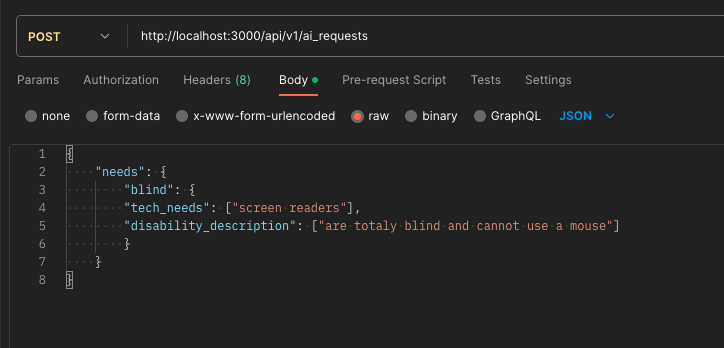
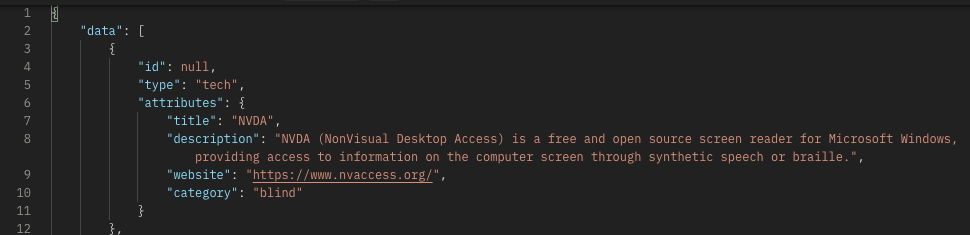
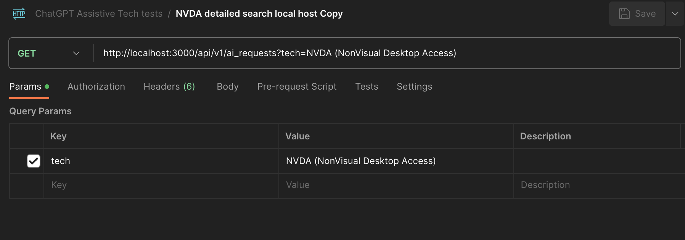
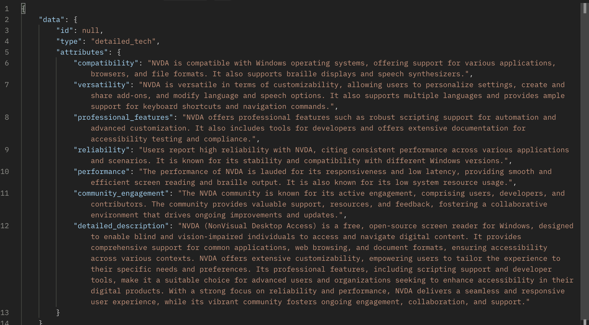

# README

## Table of Contents
- [About this App](#about-this-app)
- [Production Sites](#production-sites)
- [Associated Repos](#associated-repos)
- [Ruby Version](#ruby-version)
- [System dependencies](#system-dependencies)
- [Configuration](#configuration)
- [Tests](#tests)
- [Services](#services)
- [OpenAi API Key](#get-your-own-openai-api-key-here-httpsopenaicom)
- [Endpoints](#endpoints)
   - [POST Endpoints](#post-endpoints)
      - [AI Request](#apiv1ai_requests)
      - [Message Request](#apiv1messages)
- [Contributors](#contributors)

## About this App

This application is built as a microservice to handle communications with OpenAi specifically in the search for assistive technologies. A FE app or other service can call the endpoints to get data on technologies that can assist individuals with different kinds of disabilities. Data is formatted for ease of use by breaking each technology down into a different object with attributes describing the tech.

## Production Sites
- [User Service Production](https://nameless-stream-88171-cdff591c89ed.herokuapp.com/)
- [AI Service Production](https://dashboard.heroku.com/apps/assistivie-tech-2307)
- [AT Finder Production](https://at-finder.vercel.app/)

## Associated Repos
- [AI Service Repo](https://github.com/Assistive-Tech-2307/ai_service)
- [AT Finder Repo](https://github.com/Assistive-Tech-2307/at-finder)
- [Organization Profile](https://github.com/Assistive-Tech-2307)

## Ruby version <br>
ruby 3.2.2

## System dependencies
- Dependencies are contained in Gemfile, run `bundle` after cloning repo to install all dependencies

## Configuration
- After cloning repo to your own directory run commands in terminal:
- `bundle install`
- `rails db:create`
- To run the server in development env:
- `rails s`

## Tests
- to run the test run in terminal:
- `bundle exec rspec`

## Services
- Uses OpenAi as a chat service to get back dynamic responses on technologies, can easily be swapped out for another Ai chat services by modifying the base endpoint contained in services/ai_service.rb
#### Get your own OpenAi api key here https://openai.com/
- create an account or log-in, then request a new api_key through their dashboard
- Hide your new key by typing `EDITOR="code --wait" rails credentials:edit`
- when the file opens save your new key as<br>
`open_ai:`<br>
&nbsp; `key: "Your key here"`

#### Sign up for a Twilio free trial [here](https://login.twilio.com/u/signup?state=hKFo2SBjNm1uQk1icUVnZ2VFS0J5SkI2a3dqM29ndW1qbTlHS6Fur3VuaXZlcnNhbC1sb2dpbqN0aWTZIHFHOVNodVRNWG9SU1NaQXczRzdfRnZBeXB6Ymc0WVcyo2NpZNkgTW05M1lTTDVSclpmNzdobUlKZFI3QktZYjZPOXV1cks)
- you will need an account-sid, auth-token, and a phone number
- hide this by typing `EDITOR="code --wait" rails credentials:edit`
- when the file opens save your new information as<br>
```
twilio:
   account_sid: ACCOUNT_SID_HERE
   auth_token: ACCOUNT_TOKEN_HERE
   phone_number: PHONE_NUMBER_HERE
```

## Endpoints
### POST Endpoints
#### "/api/v1/ai_requests" <br>
example request: <br> <br>
- pass params in the body of the request
- required params {"tech_needs":[], "disability_description": []}
- even if only 1 parameter is submitted the value for each key must be an Array
- returns assistive technologies that the AI finds for the given tech needs and disability description <br>
example response: <br>  <br>

#### "/api/v1/messages" <br>
example request:
```
{
    "user_phone_number": "+13038830579",
    "title": "NVDA (NonVisual Desktop Access)"
}
```
- pass in the user's phone number and title of the tech
- receieve text message with more detailed information about a tech

successful response:
```
{
   "message": "Message successfully sent!"
}
```

DISCLAIMER: Due to the nature of trial Twilio accounts this currently only works when sending to a specific number (one that has been verified). In order to be useful in a larger instance the account would need to be taken out of trial mode.

### Get Endpoints
#### "/api/v1/ai_requests" <br>
example request: <br> <br>
- pass 1 parameter as a query parameter {tech: "name of technology"}
- returns more detailed information for the queried technology from OpenAi <br>
example response: <br>  <br>

## Contributors
- Nick Spencer <a href="https://github.com/deadbert">@github.com/deadbert</a>
- Joop Stark <a href="https://github.com/JoopStark">@github.com/JoopStart</a>
- Eliza Keating <a href="https://github.com/elizakeating">@github.com/elizakeating</a>
